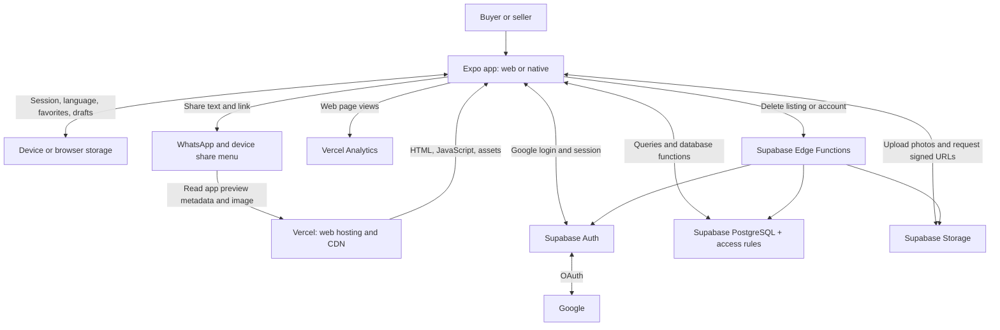
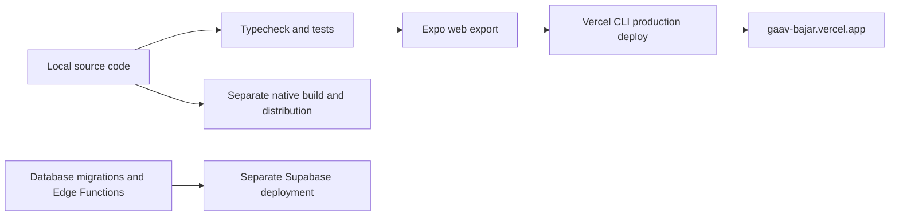

# Gaav Bajar — High-Level Design

This describes the current implementation as of 20 September 2026. Gaav Bajar is a local marketplace: people browse advertisements, post products, and contact sellers to arrange transactions outside the app.

## 1. System overview

The frontend talks directly to Supabase through its SDK. There is no separate Express or Next.js API server. PostgreSQL access rules and database functions enforce permissions even when a request bypasses the UI.

## 2. Components

| Component | Responsibility | Main source |
|---|---|---|
| App controller | Navigation, session state, loading/errors, coordination of user actions | `src/application/MarketApp.tsx` |
| Marketplace screens | Browse/search, filters, ad details, editor, favorites, and My listings | `src/features/listings/` |
| Login and profile | Google sign-in, profile details, onboarding consent, optional referral code | `src/features/auth/`, `src/features/profile/` |
| Language and shared UI | Marathi, Hindi, English; reusable buttons, fields, cards, and styling | `src/core/i18n/`, `src/shared/ui/` |
| Domain rules | Listing validation, categories, locations, phone formatting | `src/core/marketplace/domain.ts`, `src/data/` |
| Data access | Supabase queries, database function calls, photo uploads, and deletion requests | `src/core/marketplace/repository.ts` |
| Camera and gallery | Choose or capture photos, resize/compress JPEGs, enforce the three-photo limit | `photo-picker.ts`, `photos.ts`, `MarketApp.tsx` |
| Local persistence | MMKV for language/favorites; encrypted native auth store with SecureStore-held key; browser session storage; AsyncStorage for photo drafts | `src/core/storage/local.ts`, `MarketApp.tsx` |
| Supabase Auth | Google OAuth, app sessions, token refresh | `src/core/supabase/client.ts` |
| PostgreSQL | Listing/profile data, private contacts, private bids, consent, referrals, reports, blocks, and server-side rules | `supabase/migrations/` |
| Photo storage | Private `listing-photos` bucket; authorized uploads and temporary signed viewing URLs | Supabase Storage policies in migrations |
| Deletion functions | Validate the caller, hide content, remove photos, then delete the listing or account | `supabase/functions/` |
| Sharing and previews | Ad text/link sharing, deep-link handling, static app-level Open Graph and Twitter preview | `sharing.ts`, `ListingShare.tsx`, `public/index.html` |
| Hosting and analytics | Serve the web build and policy pages; collect production web analytics | `vercel.json`, `App.web.tsx`, `src/core/analytics/` |

## 3. Main user flows

### Browse and contact

1. Vercel serves the web app; a native installation runs the same shared app code.
2. The app queries active listings with search, category, district, and taluka filters.
3. Supabase returns visible listing data. The app requests photo URLs valid for 10 minutes.
4. A visitor can read public ad details without signing in.
5. To contact a seller, a buyer signs in, completes onboarding, and submits a private offer with amount and location. The seller can accept one offer; `get_contact` returns phone/WhatsApp details only to that accepted buyer or the listing owner.
6. The app opens the phone or WhatsApp action after acceptance. The marketplace does not process payments or fulfil orders.

### Google login

`App → Supabase Auth → Google account selection → Supabase → app callback → session`

The app exchanges the callback code using PKCE and persists the session locally. Web callbacks use `/auth/callback`; native callbacks use the `gaavbajar` scheme. Google verifies the email sign-in, not the seller's identity or product quality.

### Create and publish an advertisement

1. The seller signs in and completes the profile/consent step.
2. Text and Camera/Gallery photos are saved as a draft on that browser or device.
3. The app compresses photos before upload; a listing allows up to three photos.
4. `begin_listing` reserves/checks the listing, then the app uploads photos to Supabase Storage.
5. `save_listing` validates ownership, content, location, contacts, and photo paths before saving database records.
6. The result can be active or held for review under the database's text rules. Unused uploaded photos are cleaned up on a best-effort basis.

Database writes and photo uploads are separate operations. Saved drafts and stable photo paths let retries reuse previously uploaded photos. Local drafts are not a complete offline marketplace or cross-device draft sync.

### Share an advertisement or the app

- An ad share contains title, price, location, description, and `https://gaav-bajar.vercel.app/?listing=<id>`.
- The recipient opens that link; the app loads the matching public advertisement.
- WhatsApp sharing, the device share menu, and a web copy-link option provide the sharing actions.
- Social crawlers read static metadata and the branded PNG from Vercel. The preview is currently app-wide; it does not dynamically show each advertisement's photo or title.

### Delete a listing or account

`App → authenticated Edge Function → ownership check → hide content → remove photos → delete records/account`

Privileged deletion credentials remain inside Supabase Edge Functions. They are never bundled into the frontend.

## 4. Data ownership and access

| Data | Stored in | Access model |
|---|---|---|
| User identity and sessions | Supabase Auth; session persisted locally | Authenticated user session |
| Profiles and consent | PostgreSQL | Self-access and controlled database functions |
| Advertisements and photo references | PostgreSQL | Public active listings; owner access to their own records; access rules also account for seller visibility |
| Seller phone and WhatsApp numbers | Separate `private_contacts` table | Returned through `get_contact` only to the listing owner or accepted buyer |
| Buyer offers and location | Private `bids` table | Returned only through buyer-self and listing-owner RPCs |
| Product photo files | Supabase Storage | Private bucket with storage policies and signed viewing URLs |
| Reports, blocks, referrals, posting events | PostgreSQL | Restricted, purpose-specific database functions and permissions |
| Favorite IDs and language | Browser/device storage | Local to that browser or device |
| Unpublished draft and compressed photos | AsyncStorage | Local to that browser or device |
| Page-view analytics | Vercel Analytics | Production web only; auth paths excluded and query strings/fragments removed before sending |

## 5. Deployment

Web deployment is currently manual through Vercel CLI; Git auto-deployment is not connected. One configured hosted Supabase project serves the app. Separate staging and production backends are not currently configured. Web responses enforce security headers including CSP and framing denial. Native release tasks reject missing/debug signing credentials.

## 6. Practical limits

- Browsing live listings, signing in, uploading, publishing, and contacting sellers need network access.
- Favorites and drafts do not automatically sync across devices.
- Signed photo links expire; an issued URL may remain usable until expiry even after access rules change.
- Native permission changes require a new native build. A web deployment does not update an installed Android binary.
- Architecture describes intended code behavior, not proof of every device flow. Real mobile camera capture/upload and installed native acceptance remain separate verification steps.

For deeper source organization, see [ARCHITECTURE.md](ARCHITECTURE.md). For checks and remaining device-validation gaps, see [REGRESSION.md](REGRESSION.md).
